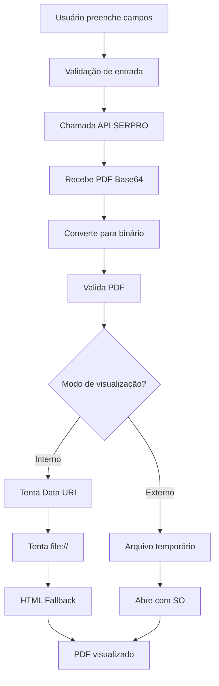

# 🎯 Gerador DARF com Visualizador Integrado - CONSOLIDARGERARDARF51

## 📋 Descrição
Projeto Delphi 10 **modular e avançado** que consome a API SERPRO `CONSOLIDARGERARDARF51` para gerar DARF em formato PDF com **visualização integrada** no próprio aplicativo, sem necessidade de arquivos externos permanentes.

## ⚡ Arquitetura Modular

### 🏗️ **Separação de Responsabilidades**
```
📦 Projeto
├── 🌐 uApiDARF.pas          # Comunicação com API SERPRO
├── 📄 uPDFViewer.pas        # Manipulação e visualização de PDF
└── 🖥️ uFormDARFViewer.pas   # Interface de usuário
```

## 🎯 Funcionalidades Principais

### ✅ **Geração de DARF**
- Interface intuitiva com campos de entrada
- Validação completa de dados
- Chamada da API SERPRO CONSOLIDARGERARDARF51
- Tratamento robusto de erros

### ✅ **Visualização Avançada**
- **Visualizador Interno**: WebBrowser integrado
- **Visualizador Externo**: Aplicativo padrão do Windows
- **Estratégia de Fallback**: Múltiplos métodos de exibição
- **Interface Responsiva**: Layout dividido otimizado

### ✅ **Gerenciamento de Arquivos**
- Conversão automática Base64 → Binário
- Validação de PDF (magic number)
- Função "Salvar Como" personalizada
- Arquivos temporários inteligentes

## 🛠️ Tecnologias e Compatibilidade

### **Delphi 10 Tokyo** (compatível com versões inferiores)
- **System.Net.HttpClient** - Requisições HTTP
- **EncdDecd** - Conversão Base64
- **OleCtrls/SHDocVw** - WebBrowser nativo
- **ShellAPI** - Integração com sistema

## 📦 Estrutura Detalhada

### **1. 🌐 uApiDARF.pas - Camada de API**
```pascal
TApiDARF
├── ChamarAPI()           # Método principal
├── MontarJSONRequest()   # Construção do JSON
└── ProcessarResposta()   # Parse da resposta
```

**Responsabilidades:**
- ✅ Comunicação exclusiva com API SERPRO
- ✅ Montagem de JSON estruturado
- ✅ Processamento de resposta
- ✅ Retorno apenas do Base64 do PDF

### **2. 📄 uPDFViewer.pas - Camada de PDF**
```pascal
TPDFViewer
├── CarregarPDFBase64()        # Conversão Base64→Binário
├── VisualizarNoWebBrowser()   # Visualização interna
├── AbrirComVisualizadorExterno() # Visualização externa
└── SalvarComo()               # Função salvar
```

**Recursos Avançados:**
- ✅ **3 Métodos de Visualização**:
  1. Data URI (PDFs < 1MB)
  2. Arquivo temporário via `file://`
  3. HTML personalizado com fallback
- ✅ **Validação de PDF** (magic number %PDF)
- ✅ **Fallback gracioso** com interface amigável

### **3. 🖥️ uFormDARFViewer.pas - Interface**
```pascal
TfrmDARFViewer
├── Painel Esquerdo    # Entrada de dados
├── Painel Direito     # Visualizador integrado
├── Controles Status   # Feedback visual
└── Opções Avançadas   # Configurações
```

## 🚀 Como Usar

### **1. Configuração Inicial**
1. Compile o projeto no Delphi 10
2. Execute o aplicativo
3. Os campos vêm **pré-preenchidos** com dados de exemplo

### **2. Geração de DARF**
```
📝 Preencher Campos:
├── Período Apuração: 12/2024
├── Data Vencimento: 20/01/2025  
├── Código Receita: 0220
├── Valores: Principal, Multa, Juros, Total
└── Observação: (opcional)

🔥 Clique "Gerar DARF"
```

### **3. Opções de Visualização**
```
🔘 Visualizador Interno (Padrão)
   └── PDF aparece no painel direito
   
🔘 Visualizador Externo
   └── Abre com aplicativo padrão
```

### **4. Ações Disponíveis**
- **🔍 Visualização**: Automática após geração
- **💾 Salvar Como**: Dialog personalizado
- **🚀 Abrir Externo**: Qualquer momento
- **🧹 Limpar**: Dados ou visualizador

## 🎮 Interface Detalhada

### **Painel Esquerdo (400px)**
```
📋 Parâmetros de Entrada
├── Período Apuração* (MaskEdit MM/YYYY)
├── Data Vencimento* (DatePicker)
├── Código Receita* (Edit numérico)
├── Valores Monetários* (4 campos)
└── Observação (Memo 500 chars)

🎛️ Controles
├── [Gerar DARF] (Botão principal)
├── [Limpar] [Abrir Externo]
└── Opções de visualização

📊 Status e Informações
├── Painel status colorido
├── Área de informações do PDF
└── Tamanho do arquivo gerado
```

### **Painel Direito (Restante)**
```
🖼️ Visualizador de PDF
├── WebBrowser em tela cheia
├── Mensagem inicial amigável
└── Fallback com instruções claras
```

## 🎨 Sistema de Feedback Visual

### **Status com Cores**
- 🟢 **Verde**: Sucesso/Pronto
- 🔵 **Azul**: Processando
- 🔴 **Vermelho**: Erro
- ⚫ **Cinza**: Neutro/Limpo

### **Informações em Tempo Real**
```
✅ Status Principal: "PDF visualizado com sucesso! (1.234 bytes)"
📋 Área de Detalhes: Informações completas da operação
📏 Tamanho PDF: "1.234 bytes" (atualizado dinamicamente)
🎛️ Botões Inteligentes: Habilitados conforme contexto
```

## 🔧 Estratégia de Visualização Avançada

### **Método 1: Data URI**
```javascript
// Para PDFs pequenos (< 1MB)
data:application/pdf;base64,JVBERi0xLjQK...
```
- ✅ **Mais rápido**: Sem arquivos temporários
- ✅ **Mais limpo**: Tudo em memória
- ⚠️ **Limitação**: Tamanho máximo do navegador

### **Método 2: Arquivo Temporário**
```
// Navegação direta para arquivo
file:///C:/Temp/DARF_20241218_143052.pdf
```
- ✅ **Mais compatível**: Funciona na maioria dos casos
- ✅ **Sem limitação**: Qualquer tamanho de PDF
- ⚠️ **Arquivo temporário**: Criado automaticamente

### **Método 3: HTML Personalizado (Fallback)**
```html
<!DOCTYPE html>
<html>
  <body>
    <embed src="file:///pdf" type="application/pdf">
      <div class="fallback">
        ✅ PDF Gerado com Sucesso!
        📊 Tamanho: 1.234 bytes
        💡 Use "Abrir Externo" para visualizar
      </div>
    </embed>
  </body>
</html>
```

## 📊 Exemplo Prático

### **Dados de Entrada**
```
Período: 12/2024
Vencimento: 20/01/2025
Código: 0220
Principal: R$ 1.000,00
Multa: R$ 50,00
Juros: R$ 25,00
Total: R$ 1.075,00
Obs: "DARF gerado via API"
```

### **Resultado Esperado**
```
✅ Status: "PDF visualizado com sucesso! (1.234 bytes)"
📄 PDF: Exibido no painel direito
📋 Info: Detalhes completos da geração
🎛️ Botões: Todos habilitados para ações
```

## 🚨 Tratamento de Erros Robusto

### **Validações de Entrada**
- ✅ Campos obrigatórios preenchidos
- ✅ Formato de valores monetários
- ✅ Período de apuração válido
- ✅ Data de vencimento coerente

### **Tratamento de API**
- ✅ Conectividade de rede
- ✅ Status HTTP da resposta
- ✅ Estrutura JSON válida
- ✅ Campo 'darf' presente

### **Tratamento de PDF**
- ✅ Conversão Base64 bem-sucedida
- ✅ Magic number %PDF válido
- ✅ Tamanho mínimo do arquivo
- ✅ Capacidade de criação de arquivo temporário

### **Fallbacks Inteligentes**
```
API Falha → Mensagem clara + detalhes
PDF Inválido → Informação específica
WebBrowser Falha → HTML personalizado
Arquivo Falha → Orientação alternativa
```

## ⚙️ Configuração da API

### **Endpoint SERPRO**
```
URL: https://gateway.apiserpro.serpro.gov.br/integra-contador-trial/v1/Emitir
Serviço: CONSOLIDARGERARDARF51
Método: POST
Token: Bearer 06aef429-a981-3ec5-a1f8-71d38d86481e
```

### **Estrutura JSON**
```json
{
  "contratante": {"numero": "99999999999999", "tipo": 2},
  "autorPedidoDados": {"numero": "99999999999999", "tipo": 2},
  "contribuinte": {"numero": "99999999999999", "tipo": 2},
  "pedidoDados": {
    "idSistema": "SICALC",
    "idServico": "CONSOLIDARGERARDARF51",
    "versaoSistema": "2.9",
    "dados": "{...parâmetros do DARF...}"
  }
}
```

## 🔄 Fluxo Completo



## 🎯 Vantagens Desta Arquitetura

### ✅ **Modularidade**
- Cada classe tem responsabilidade única
- Fácil manutenção e testes
- Reutilização de componentes

### ✅ **Robustez**
- Múltiplos fallbacks
- Tratamento completo de erros
- Validações em todas as camadas

### ✅ **Usabilidade**
- Interface intuitiva
- Feedback visual constante
- Opções flexíveis de visualização

### ✅ **Performance**
- Processamento em memória
- Arquivos temporários inteligentes
- Estratégias otimizadas por tamanho

## 🔮 Possíveis Melhorias Futuras

- 🎨 **Temas personalizáveis**
- 💾 **Cache de configurações**
- 📊 **Histórico de geração**
- 🔄 **Processamento em lote**
- 🌐 **Suporte a múltiplas APIs**
- 📱 **Layout responsivo avançado**

---

**🚀 Projeto otimizado para produção - Delphi 10 compatível**

*Desenvolvido com foco em modularidade, robustez e experiência do usuário*